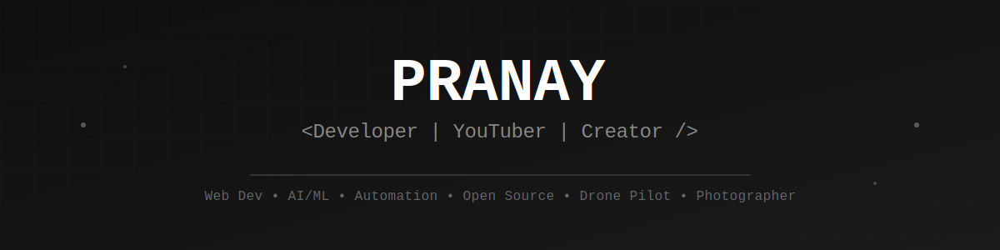

<div align="center">
  
</div>

<div align="center">
  
  [](https://sciencegear.netlify.app/)
  [](https://www.youtube.com/c/ScienceGearYT)
  
</div>

---

## 👨‍💻 About Me

```javascript
const pranay = {
    role: "Full Stack Developer & Content Creator",
    location: "India 🇮🇳",
    passions: ["Coding", "Tech", "Content Creation"],
    currentFocus: ["Web Development", "AI/ML", "Gen AI", "Game Development"],
    funFact: "Drone Pilot 🚁 | Photographer 📸 | Videographer 🎥",
    motto: "Urge to learn everything!"
};
```

🌟 **YouTuber** creating coding and tech content  
🔧 Building projects in **Web Dev, AI/ML, Automation** & exploring **Game Development**  
🤝 Love **Open Source Contributions**  
📚 Always learning new languages and technologies  

---

## 🌐 Connect With Me

<div align="center">
  
[](https://www.youtube.com/c/ScienceGearYT?sub_confirmation=1)
[](https://www.linkedin.com/in/pranaytanpure)
[](https://dsc.gg/sciencegear)
[](https://www.instagram.com/science_gear)
[](https://x.com/ScienceGearYT)
[](https://facebook.com/ScienceGearYT)
[](https://sciencegear.netlify.app/)

</div>

---

## 💻 Tech Stack

### Programming Languages


### Web Development


### Cloud & Hosting


### Databases


---

## 🛠️ Tools & Software

### Development Environments


### Design & Creative Tools


### Other Tools


---

## 📊 GitHub Stats

<div align="center">
  


</div>

---

## 🏆 GitHub Trophies

<div align="center">
  


</div>

---

## 📺 Latest YouTube Videos

<!-- YOUTUBE:START -->
<!-- YOUTUBE:END -->

> 🔔 Subscribe to my channel for coding tutorials and tech content!

---

## ✍️ Random Dev Quote

<div align="center">


</div>

---

## 📈 Profile Views

<div align="center">
  
[](https://visitcount.itsvg.in)

</div>

---

## 💰 Support My Work

<div align="center">

If you like my content and want to support me, consider buying me a coffee! ☕

[](https://buymeacoffee.com/sciencegear)
[](https://ko-fi.com/sciencegear)
[](https://patreon.com/sciencegear)

</div>

---

<div align="center">
  
### 💭 *"The urge to learn everything drives innovation"*

**Open for collaborations and exciting projects!**

[](https://github.com/ScienceGear)

</div>
